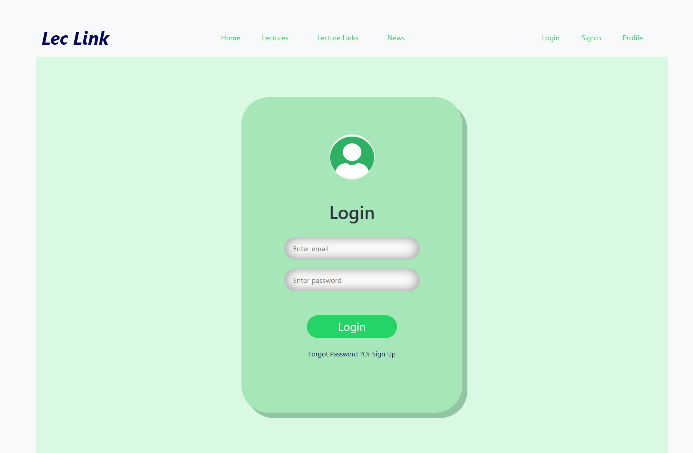
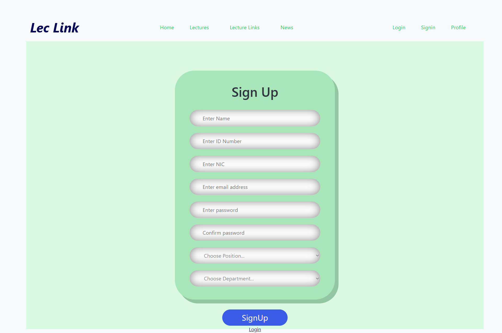
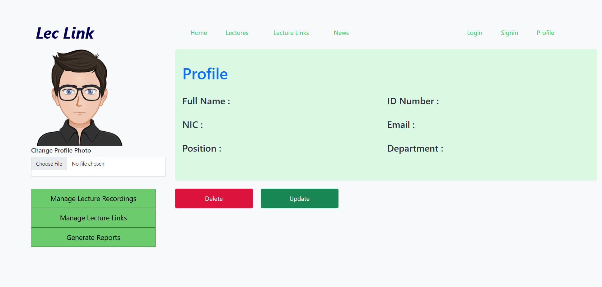
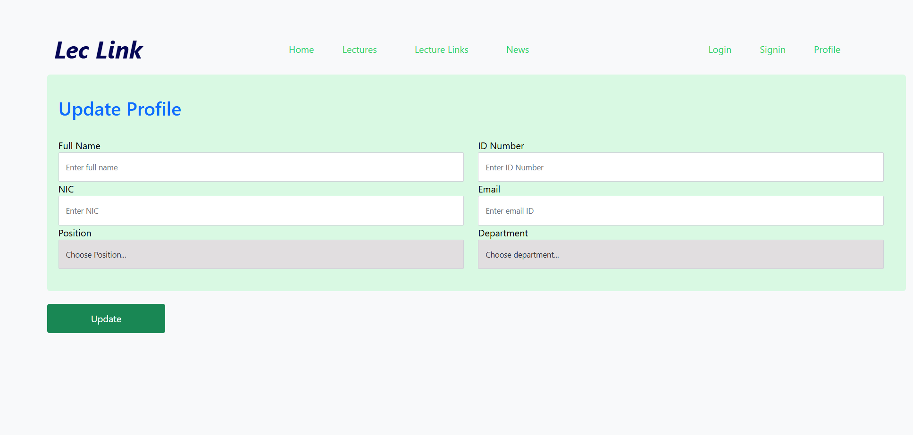
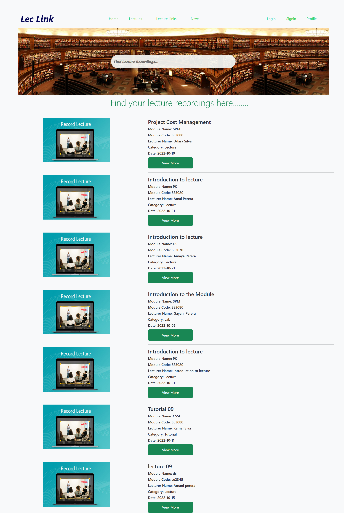
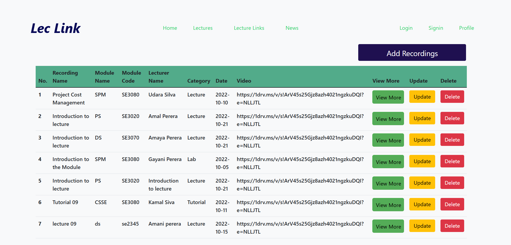
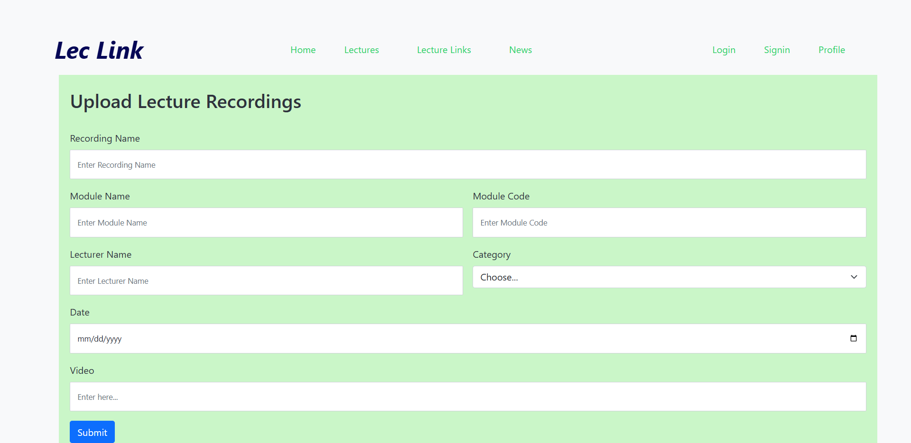
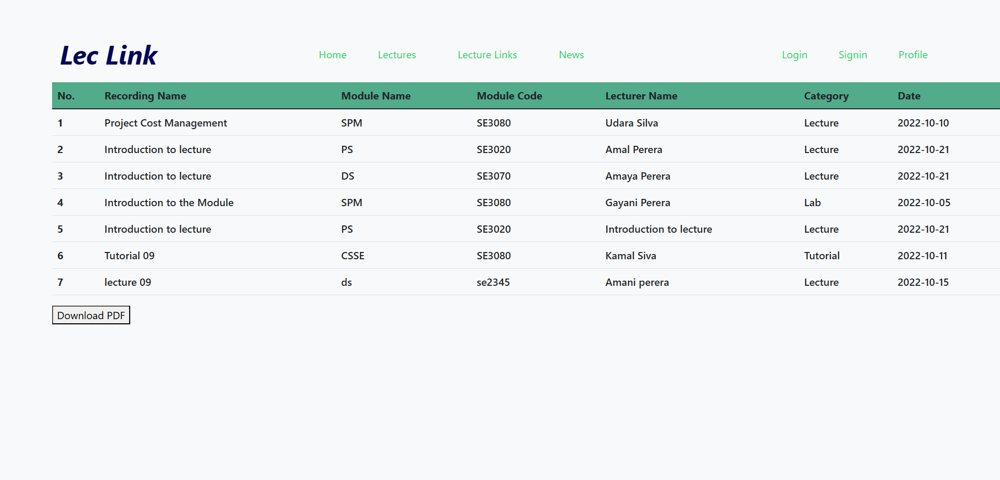

# LekLink Web Application

LekLink is a platform designed to simplify the scheduling of lecture links and the management of lecture recordings for academics. It provides an intuitive interface for educators to organize virtual class links and capture sessions, enhancing accessibility to course materials. This is the part of the project I contributed to, which includes user management features such as login, signup, and profile management, as well as lecture recording management for efficiently organizing and reviewing recorded lectures.

## Table of Contents

- [Project Interfaces](#project-interfaces)
- [Technologies Used](#technologies-used)
- [Prerequisites](#prerequisites)
- [Installation](#installation)
- [Set Up Environment Variables](#set-up-environment-variables)
- [Run the Project](#run-the-project)

## Project Interfaces

### Login page


### SignUp page


### User Profile page


### Update Profile page


### Lecture Recordings page Student View


### Lecture Recordings page Admin View


### Add Lecture Recordings page


### Generate Report page


## Technologies Used

- React.js
- Node.js
- Express.js
- MongoDB

## Prerequisites

Before you begin, ensure you have met the following requirements:

1. **Node.js**: [Download Node.js](https://nodejs.org/en/download/)
   - Node.js is required to run the backend and frontend of the application.

2. **npm**: Comes bundled with Node.js.

3. **MongoDB**: 
   - You can either install MongoDB locally or use MongoDB Atlas.
   - **Local Installation**: [Install MongoDB Community Edition](https://docs.mongodb.com/manual/installation/)
   - **MongoDB Atlas Setup**: [Getting Started with Atlas](https://docs.atlas.mongodb.com/getting-started/)

4. **Postman** (optional): Useful for testing API endpoints.
   - **Postman**: [Download Postman](https://www.postman.com/downloads/)

5. **Git**: [Download Git](https://git-scm.com/downloads)

## Installation

1. **Clone the repository:**

      ```bash
      git clone https://github.com/PamudiNaveesha/LekLink_Web_Application.git
      cd LekLink_Web_Application

2. **Install dependencies:**

   1. **For the backend**

      ```bash
      cd BACKEND
      npm install

   2. **For the frontend**

      ```bash
      cd frontend
      npm install

## Set Up Environment Variables

1. Open the `.env` file in the **BACKEND** folder of your project.
2. Add the following line to the file:
   
   ```plaintext
   MONGODB_URI=mongodb+srv://<username>:<password>@<clustername>.mongodb.net/<database>
   
4. **MONGODB_URI**: This is the key that your application will use to access the MongoDB database.
5. **MongoDB URI Format**: Replace `<username>`, `<password>`, `<clustername>`, and `<database>` with your actual MongoDB credentials and database name.
  
## Run the Project

   1. **For the backend**

      ```bash
      cd BACKEND
      npm run dev

   2. **For the frontend**

      ```bash
      cd frontend
      npm start 
